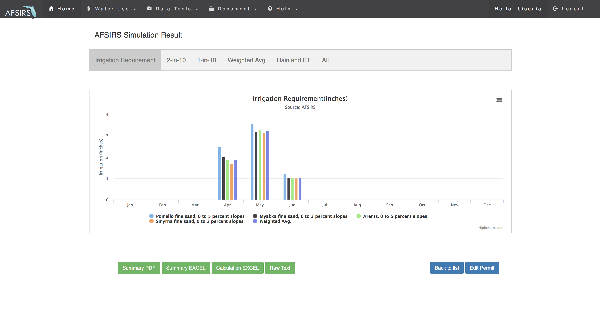

# AFSIRS Online

AFSIRS Online is a web-based irrigation simulation platform that modernizes the **Agricultural Field Scale Irrigation Requirements Simulation (AFSIRS)** model originally developed at the University of Florida.

The system allows researchers, agricultural planners, and water management agencies to estimate irrigation requirements for crop production based on soil characteristics, irrigation systems, crop parameters, and historical climate data.

The original AFSIRS model estimates irrigation requirements using a **soil root-zone water balance**, incorporating rainfall, evapotranspiration, soil water storage, irrigation efficiency, and drainage losses.

AFSIRS Online transforms this legacy research model into a **modern web application with GIS integration, database-backed datasets, and interactive visualization tools**.

---

# Screenshots




---

# Key Features

### Web-based irrigation simulation

Users can configure irrigation simulations through a browser-based workflow rather than running standalone modeling software.

### Interactive GIS soil selection

An interactive map allows users to draw a **polygon representing a field boundary** and retrieve soil data from a GIS soil database.

### Soil dataset management

Users can create soil datasets using:

- GIS-based soil lookup
- predefined soil types
- stored datasets for future simulations

### Climate data integration

The system integrates historical weather records from **FAWN (Florida Automated Weather Network)** stations to drive irrigation calculations.

### Simulation configuration

Users configure irrigation simulations using parameters including:

- irrigation system type
- irrigation efficiency
- crop coefficients
- soil characteristics
- climate station selection

### Visualization and reporting

Simulation outputs include:

- irrigation requirement graphs
- rainfall and evapotranspiration charts
- seasonal and monthly summaries
- downloadable PDF reports

---

# Technology Stack

## Backend

- **Java**
- **SparkJava** micro web framework
- **Jetty embedded server**
- **FreeMarker** template engine

## Frontend

- **Bootstrap**
- **jQuery**
- **ArcGIS JavaScript API**

## Data Integration

- GIS soil database
- FAWN climate data
- simulation datasets stored in database

## Deployment

- Deployable on **Heroku**
- Lightweight Java application architecture
- Embedded server for simplified deployment

---

# System Architecture
```text
Client Browser
   |
   | HTTP
   v
SparkJava Web Application
   |
   +-- FreeMarker Templates
   +-- Simulation Controllers
   +-- Soil Data Services
   |
   v
Jetty Embedded Server
   |
   v
Databases / Data Sources
   +-- GIS Soil Database
   +-- FAWN Climate Data
   `-- Simulation Results
```

The application can run locally or be deployed to cloud platforms such as **Heroku**, allowing researchers and agricultural planners to access irrigation simulation tools through a standard web browser.

---

# Interactive Soil Map

A core feature of AFSIRS Online is the **interactive soil map tool**, which allows users to select soil data geographically.

The map interface is implemented using:

- ArcGIS JavaScript API
- FreeMarker templates
- Bootstrap
- jQuery

### Workflow

1. Open the Soil Map tool.
2. Draw a polygon representing a field boundary.
3. Query the GIS soil database.
4. Retrieve soil series and component information within the selected area.
5. Save the soil dataset for use in irrigation simulations.

The soil data retrieved from the map interaction is used as input parameters for irrigation requirement calculations.

---

# Simulation Workflow

Typical workflow for running a simulation:

1. Create a user account
2. Define a **soil dataset** using GIS tools
3. Create a **simulation dataset (water-use permit)**
4. Configure irrigation system parameters
5. Select soil and climate data
6. Run the irrigation simulation
7. Analyze results using charts and reports

---

# Example Outputs

The model produces several outputs including:

- irrigation requirement charts
- rainfall and evapotranspiration summaries
- seasonal irrigation demand
- soil characteristic summaries
- downloadable PDF reports

These outputs help agricultural planners estimate irrigation demand for crop production systems.

---

# Running the Application

## Local Development
mvn clean package
java -jar afsirs-online.jar


The application will start an embedded Jetty server.

---

## Deploying to Heroku

The system can be deployed to **Heroku using the Java buildpack**.

Typical deployment workflow:


git push heroku main


The embedded Jetty server allows the application to run without additional server configuration.

---

# Project Background

The original AFSIRS model was developed in the **University of Florida Agricultural and Biological Engineering Department** to support irrigation planning and water resource management.

AFSIRS Online was created to modernize the legacy system by adding:

- web-based user interfaces
- GIS soil data integration
- database-backed workflows
- cloud deployment capability
- interactive visualization

---

# Engineering Highlights

This project demonstrates how scientific modeling systems can be modernized into scalable web applications.

Key engineering aspects include:

- integrating legacy agricultural simulation models into web architecture
- GIS-based soil data retrieval using polygon map interaction
- translating soil composition data into simulation inputs
- combining scientific modeling with modern web technologies

---

# Author

**Meng Zhang**  
Software Engineer / Research Systems Developer  

University of Florida  
Agricultural and Biological Engineering

---

# License

This repository contains research software developed for agricultural irrigation modeling. S
